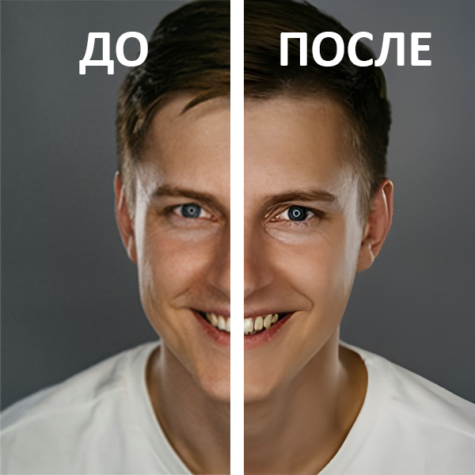
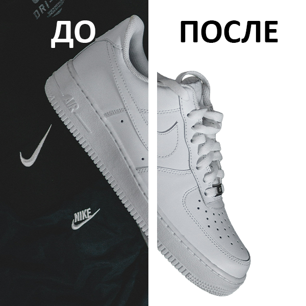
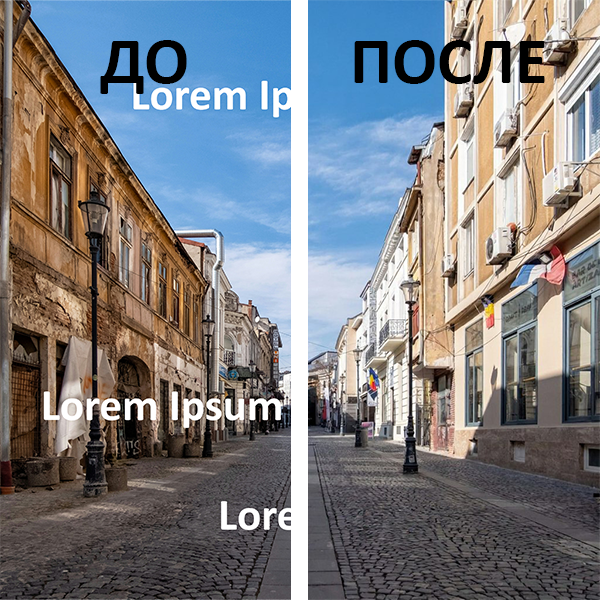
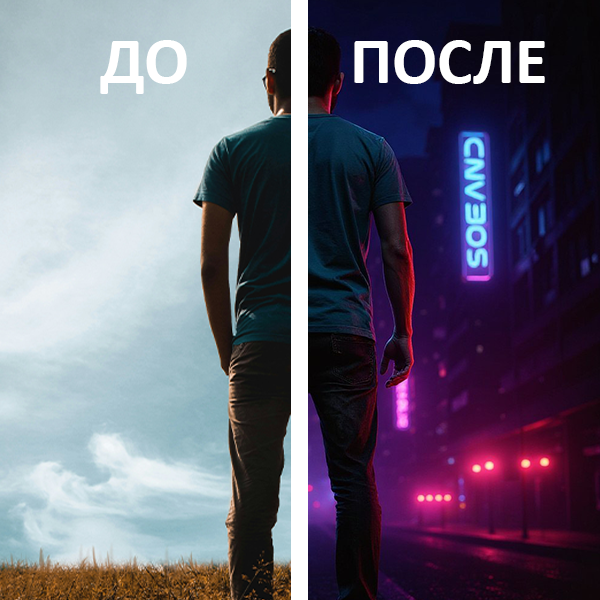

# Image Bot
Telegram bot for fast image processing - increasing resolution, removing background, removing text from photos and changing artistic style. The user simply sends a photo and selects the desired action, the bot processes and sends the result in seconds.

Suitable for preparing product photos for marketplaces, restoring old/poor quality photos, designing social networks and creatives.

## Examples

